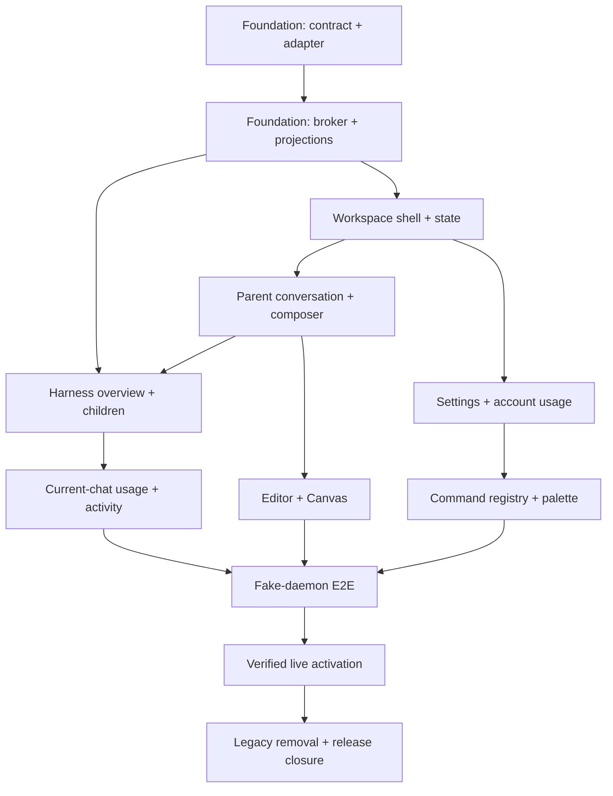

# Prime Studio Implementation Program

> **For agentic workers:** REQUIRED SUB-SKILL: Use superpowers:subagent-driven-development (recommended) or superpowers:executing-plans to implement this plan task-by-task. Steps use checkbox (`- [ ]`) syntax for tracking.

**Goal:** Build the complete Prime Studio prototype feature set on the current public codebase, with real resident Prime Harness integration through a verified, upgrade-resilient adapter.

**Architecture:** Keep Tauri/Rust/React/Vite. Refactor the renderer into feature slices and normalized projections, place all live Harness access behind a Rust-owned broker and Studio-owned Node sidecar, and activate effects only after exact runtime identity and capability negotiation. Deliver each phase as working software with truthful unavailable states.

**Tech Stack:** Tauri 2.11.5, Rust 1.97, React 19.1, TypeScript 5.8, Vite 7, Node 22.x, Vitest, Playwright/axe, Node test runner, Cargo.

## Global Constraints

- Baseline is public `main` commit `2540d1d8c5c58b5d9d29d0a6ccc63d826ec24d50`.
- Prime Harness remains separately installed; do not bundle or modify it.
- No renderer access to credentials, raw SDK objects, daemon pipes, executable paths, or unrestricted filesystem/process operations.
- Harness semver is descriptive only; exact runtime identity, protocol/schema identity, and capabilities determine compatibility.
- Main chat contains parent-channel content only. Child content is visible only in the selected-child inspector route.
- Right-panel Usage is current-chat only. Account-wide usage is Settings → Usage only.
- Ordinary child execution has no invented approval UI; only verified extension UI requests create contextual prompts.
- Unknown, stale, incompatible, replayed, oversized, or impossible data fails closed.
- Preserve every existing authority, account, browser, computer-use, scheduler, artifact, provider, bounded-I/O, and project-catalog invariant.
- Use original project assets and code. Reference products establish familiar topology, not copyable assets or implementation.
- Meet the accessibility, resource-bound, migration, and release contracts in the design specification.

---

## Program documents

Execute these plans in order. A later plan may start only when the prior plan's exit gate and independent review are green.

1. [Runtime foundation and compatibility](2026-08-12-prime-studio-runtime-foundation.md)
2. [Workspace shell, navigation, conversation, and composer](2026-08-12-prime-studio-workspace-ui.md)
3. [Harness inspector, child detail, usage, and activity](2026-08-12-prime-studio-harness-inspector.md)
4. [Editor, settings, account usage, and command palette](2026-08-12-prime-studio-settings-editor.md)
5. [Activation, migration, end-to-end verification, and release closure](2026-08-12-prime-studio-activation-verification.md)

## Dependency graph



## Milestone gates

| Milestone | Runnable result | Live execution |
|---|---|---|
| M0 Characterization | Current app behavior/security frozen by tests | unavailable |
| M1 Foundation | Runtime discovery and compatibility page against fixtures | unavailable |
| M2 Workspace | New shell/navigation/parent chat against fixture projections | unavailable |
| M3 Inspector | Full Harness/child/usage/activity against fake adapter | unavailable |
| M4 Product surfaces | Editor/settings/palette/account usage complete | unavailable |
| M5 Integrated | Tauri → Rust → sidecar → fake daemon passes | fake only |
| M6 Activated | reviewed exact Harness profile creates/reattaches resident sessions | verified profile only |
| M7 Closure | old raw paths removed; docs/privacy/SBOM/release gates updated | verified profile only |

## Feature traceability

The design specification is the source of feature IDs. This matrix ensures no prototype feature is left without a build task.

| Feature IDs | Owning tasks |
|---|---|
| SH-01–SH-10 | UI-02, UI-07, SE-05, ACT-05 |
| NV-01–NV-10 | UI-03, SE-04 |
| CV-01–CV-15 | UI-04, UI-06, SE-01, ACT-03 |
| CP-01–CP-10 | UI-05, SE-02, SE-04 |
| CP-11 | Explicitly deferred by design; privacy/audio specification required |
| HR-01–HR-11 | HI-01, HI-03, ACT-01 |
| HR-12–HR-17 | HI-02, ACT-01 |
| HR-18 | HI-05 |
| CU-01–CU-08 | HI-03 |
| AC-01–AC-06 | HI-04 |
| ED-01–ED-07 | SE-01 |
| ST-01–ST-14 | SE-02, SE-05 |
| AU-01–AU-06 | SE-03 |
| PL-01–PL-04 | SE-04 |
| CM-01–CM-06 | UI-07, SE-04, ACT-05 |
| Undo edit, kernel variables, unsupported quota, direct browser/computer dispatch | Explicit exclusions; keep unavailable until separate verified authorities exist |

## Cross-plan interfaces

These names are fixed before implementation. Changes require updating every dependent plan and the design specification in the same reviewed commit.

```ts
export type ChatId = string;
export type SessionId = string;
export type AgentId = string;

export type HarnessCapability =
  | "attach_snapshot"
  | "event_sequence"
  | "resident_sessions"
  | "session_input_admission"
  | "model_catalog"
  | "extension_ui"
  | "chunked_snapshot"
  | "prompt_admission_cancellation"
  | "queue_management"
  | "resource_snapshot"
  | "delete_child"
  | "heartbeat_catalog"
  | "heartbeat_management"
  | "side_question_transcript"
  | "transient_bash";

export type HarnessCompatibility =
  | { status: "ready"; profile: string; capabilities: readonly HarnessCapability[] }
  | { status: "degraded"; profile: string; capabilities: readonly HarnessCapability[]; unavailable: readonly UnavailableFeature[] }
  | { status: "read_only"; reason: HarnessUnavailableReason; runtime?: RuntimeIdentity }
  | { status: "unavailable"; reason: HarnessUnavailableReason };

export type HarnessUnavailableReason =
  | "not_installed"
  | "runtime_identity_mismatch"
  | "unsupported_protocol"
  | "unsupported_schema"
  | "missing_mandatory_capability"
  | "transport_unavailable"
  | "security_verification_failed";

export interface UnavailableFeature {
  capability: HarnessCapability;
  reason: HarnessUnavailableReason;
}

export interface HarnessCursor {
  runtimeGeneration: string;
  sequence: number;
}

export type MessageBlock =
  | { kind: "text"; text: string }
  | { kind: "thinking"; text: string; redacted: boolean }
  | { kind: "tool_call"; toolCallId: string; toolId: string; status: "pending" | "running" | "blocked" | "succeeded" | "failed" };

export type ParentMessage =
  | { channel: "parent"; kind: "user"; id: string; text: string; emittedAtMs: number }
  | { channel: "parent"; kind: "assistant"; id: string; blocks: readonly MessageBlock[]; streaming: boolean; emittedAtMs: number }
  | { channel: "parent"; kind: "notice"; id: string; text: string; emittedAtMs: number };

export interface ChildAgentSummary {
  id: AgentId;
  status: "queued" | "running" | "done" | "error" | "cancelled" | "unknown";
  task: string;
  provider: string | null;
  model: string | null;
  progress: number | null;
}

export interface QueueItem { id: string; label: string; state: "queued" | "admitted" | "running" | "cancelled"; }
export interface ToolDefinition { id: string; label: string; enabled: boolean; configurable: boolean; }
export interface ContextSource { id: string; label: string; kind: string; availability: "available" | "unavailable"; }
export interface CurrentChatUsage {
  input: number;
  output: number;
  cacheRead: number;
  cacheWrite: number;
  totalTokens: number;
  cost: number | null;
}

export interface RootSessionSnapshot {
  sessionId: string;
  accountId: string | null;
  projectId: string;
  chatId: string;
  cursor: HarnessCursor;
  state: "idle" | "working" | "blocked" | "failed" | "disconnected" | "stopped";
  parentMessages: readonly ParentMessage[];
  children: readonly ChildAgentSummary[];
  queue: readonly QueueItem[];
  tools: readonly ToolDefinition[];
  resources: readonly ContextSource[];
  usage: CurrentChatUsage;
}

export interface RootSessionProjection extends RootSessionSnapshot {
  freshness: "live" | "stale" | "disconnected";
  observedAtMs: number;
}

export type InspectorRoute =
  | { kind: "overview" }
  | { kind: "child"; childId: string; tab: "chat" | "activity" | "files" }
  | { kind: "usage" }
  | { kind: "activity"; filter: "all" | "agents" | "tools" | "files" };
```

Rust owns the same closed shapes in generated `harness/generated.rs`. The renderer consumes only generated Tauri DTOs and never imports sidecar types.

## Required implementation discipline

Every task follows this exact cycle:

1. create the focused failing test;
2. run it and record the expected behavioral failure;
3. implement the smallest complete slice;
4. run focused tests, typecheck/check, and diff check;
5. commit the slice with no unrelated changes;
6. request an independent correctness/security or UI review appropriate to the slice;
7. apply review findings with a fresh RED → GREEN commit;
8. run the task exit gate before starting dependent work.

No task may enable live runtime authority merely because fixture UI is green.

## Program-wide final commands

Run from repository root or `app/` exactly as documented:

```powershell
node --test tests/*.mjs
cd app
npm ci
npm test -- --maxWorkers=1 --no-file-parallelism
npm run check
npm run build
npm run test:bundle
npm run test:browser-shell:strict
cargo fmt --manifest-path .\src-tauri\Cargo.toml --all -- --check
cargo check --manifest-path .\src-tauri\Cargo.toml --locked --all-targets --features test-support-bin
cargo clippy --manifest-path .\src-tauri\Cargo.toml --locked --all-targets --features test-support-bin -- -D warnings
cargo test --manifest-path .\src-tauri\Cargo.toml --locked --all-targets --features test-support-bin
cd ..
git diff --check
git status --short
```

Expected: every command exits 0, status is clean after the final commit, browser shell has no serious/critical axe findings, and no activation test touches a real profile or workspace.

## Rollback rule

Each milestone is independently revertible. If M6 activation fails in the field, disable the adapter profile in compatibility policy and ship read-only/degraded mode; do not restore the old raw RPC path. Persisted records include schema versions and forward migrations while retaining a backup sufficient to return to the prior Studio schema.
