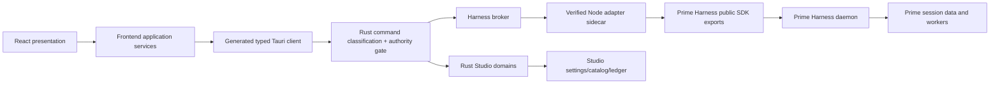
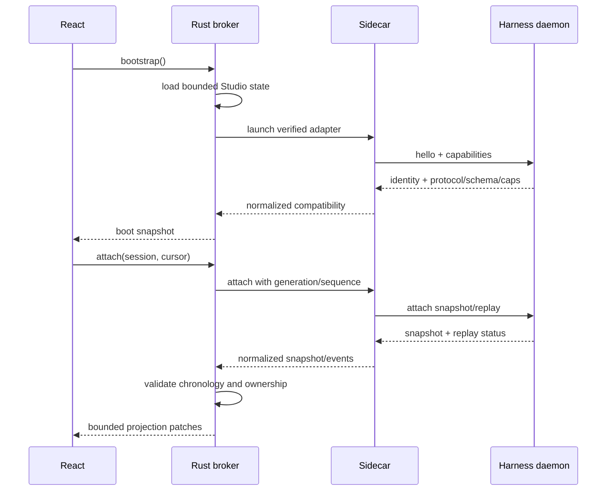

# Prime Studio Harness Workspace Design

**Date:** 2026-08-12
**Status:** Approved direction; implementation not started
**Baseline:** public `main` at `2540d1d8c5c58b5d9d29d0a6ccc63d826ec24d50`
**Mode:** Operate
**Decision owner:** project owner delegated completion and self-review

## 1. Purpose

This specification turns the owner-supplied Prime Studio prototype into a complete production
contract before implementation. It accounts for every prototype surface, assigns an authoritative
data source, defines unavailable/degraded behavior, preserves existing hardened boundaries, and
sets a test oracle for each feature.

The result is a familiar desktop-chat shell with three stable regions:

```text
┌──────────────────┬────────────────────────────────────┬──────────────────────────┐
│ Projects & chats │ Parent conversation                │ Harness inspector        │
│                  │                                    │                          │
│ project tree     │ parent messages only               │ overview / selected child│
│ chat history     │ streaming answer                   │ this-chat usage          │
│ archived chats   │ fixed composer                     │ activity / tools / files │
│ settings entry   │                                    │                          │
└──────────────────┴────────────────────────────────────┴──────────────────────────┘
```

The parent transcript never contains child-agent reasoning, child tool runs, child system entries,
or child completion summaries. Selecting a child in the right panel is the only route to its
private transcript and operational detail.

## 2. Confirmed product decisions

1. Current public `main` is the canonical code baseline.
2. The supplied prototype and prior rejected redesign are references, not implementation bases.
3. Tauri + Rust + React + TypeScript + Vite remain the product architecture.
4. The architecture is refactored around a versioned Harness adapter instead of rewritten.
5. The final milestone activates real resident Prime Harness sessions.
6. Activation is staged: unsupported or unverified runtimes remain read-only or unavailable.
7. The right panel reports current-chat usage only; Settings reports account-wide usage.
8. Ordinary child-agent work creates no approval UI. Only genuine runtime extension UI requests
   create contextual prompts.
9. ChatGPT Desktop is the structural and interaction convention; Prime Studio remains an original
   product with its own assets, contracts, copy, tokens, and Harness-specific information design.

## 3. Approaches considered

### A. Verified Node adapter behind Rust — selected

A Studio-owned Node sidecar imports the installed Prime Harness public package exports. Rust owns
sidecar launch, identity verification, request admission, bounded transport, process containment,
and renderer projection. The adapter negotiates daemon protocol/schema/capabilities and converts
runtime-specific objects into a stable Studio protocol.

**Why selected:** it uses the Harness's own public client types, avoids duplicating a fast-moving
daemon protocol in Rust, keeps credentials and runtime objects outside the renderer, and lets
Studio support multiple Harness compatibility profiles behind one UI contract.

### B. Rust-native daemon protocol client — rejected as primary

Rust could connect directly to the daemon pipe and reimplement the protocol.

**Advantages:** one native process and fewer runtime dependencies.
**Rejection reason:** Studio would duplicate upstream framing, snapshots, sequences, lifecycle,
extension UI, and compatibility tables. Every Harness schema change would become a risky Rust/UI
migration before the app could start.

### C. Renderer imports Harness or shells directly — rejected

The React webview could import the Harness package or invoke CLI commands.

**Advantage:** shortest prototype path.
**Rejection reason:** it crosses credential, process, filesystem, and authority boundaries; makes
version drift a renderer crash; and bypasses the repository's native security model.

### 3.1 Current architecture assessment

The Tauri/React choice is not the problem and should not be recreated. It already provides the
right renderer/native separation, a mature Windows shell, accessible web UI tooling, and a Rust
boundary suitable for local process and filesystem authority.

The current implementation does need a substantial internal refactor:

- `App.tsx` owns boot, routes, tabs, settings, fleet, layout, and session annotations, so unrelated
  product changes collide in one component.
- `useSession.ts` combines process ownership, reconnect, history loading, runtime commands,
  reducer dispatch, model/thinking state, and daemon identification in one hook.
- `rpc.ts` mixes transport, strict decoders, account management, process control, usage, settings,
  filesystem reads, and optional fallbacks. Several fallbacks convert unavailable infrastructure
  into empty values that a richer UI could misread as truth.
- `types.ts` and the raw RPC union contain open runtime shapes. They are tied to an older view of
  Prime Agent instead of a negotiated adapter contract.
- The frontend's one-hook-per-tab process model is incompatible with resident daemon ownership,
  snapshot/replay chronology, and centralized recovery.
- Layout and small bits of identity currently live in component state or browser storage rather
  than a versioned Studio persistence model.
- Some transcript paging still reacquires a complete history before selecting a bounded window.
- `lib.rs` is a large composition and implementation module, making it difficult to review which
  native command owns which effect and storage boundary.

The codebase also contains assets that must be preserved rather than replaced:

- native command classification and fail-closed authority;
- bounded I/O and process environment/containment primitives;
- transactional account management and recovery;
- provider, scheduler, artifact, browser, computer-use, project-catalog, and usage contracts;
- transcript residency bounds, accessibility tests, browser-shell isolation, dependency policy,
  privacy/provenance checks, and release controls.

Therefore the redesign is a boundary and composition refactor around existing hardened domains,
not a framework rewrite.

## 4. Target architecture



### 4.1 Renderer layers

`app/src/` is reorganized without a framework change:

```text
app/src/
  app/                 composition, routes, providers, global shortcuts
  features/
    shell/             title/status bars, pane geometry, responsive drawers
    navigation/        projects, chats, pinned, archived, unread
    conversation/      parent transcript, branches, composer, edited-files card
    harness/           overview, children, queue, tools, context, activity
    editor/            diff, edit, Canvas
    settings/          settings routes, account-wide usage, accounts/models/tools
    command-palette/   actions, chats, message search
  entities/            normalized project/chat/session/agent/tool/usage projections
  shared/
    ipc/               generated request/result types and strict decoders
    state/             store primitives and selector utilities
    ui/                tokens and accessible controls
```

Rules:

- Components render projections and emit intents; they never call Tauri directly.
- Feature services own asynchronous commands, cancellation, and stale-response rejection.
- Entity stores are normalized by stable identifiers.
- Runtime event reduction is pure and deterministic.
- Selectors derive view models; components do not join runtime records ad hoc.
- Unknown or stale data is represented in the type system, not converted to empty success.

### 4.2 Rust layers

Existing security-focused modules remain. `lib.rs` stops being the implementation home for every
command and becomes composition only:

```text
app/src-tauri/src/
  app_state.rs
  commands/            thin validated Tauri handlers by feature
  authority/           existing classification plus activation receipts
  harness/
    broker.rs           lifecycle, ownership, request routing
    protocol.rs         Studio-side DTOs and closed decoding
    sidecar.rs          contained sidecar process and framed transport
    compatibility.rs    runtime identity and capability decisions
    projections.rs      credential-free renderer snapshots
  storage/             settings, layout, project catalog, usage ledger
  existing domains/    accounts, browser, computer use, artifacts, scheduler
```

No existing strict account, browser, computer-use, artifact, scheduler, project-catalog,
bounded-I/O, process-environment, or authority invariant is weakened merely to activate the UI.

### 4.3 Node adapter

The sidecar is a private runtime component, not an npm dependency bundled as Prime Harness. It
loads the user's separately installed package only after Rust verifies an activation manifest.

Responsibilities:

- import documented package-root exports such as `DaemonClient`, `DaemonAgentConnection`,
  `AgentConnection`, `AuthStorage`, and `ModelRegistry`;
- connect to the daemon and perform hello/capability negotiation;
- create resident sessions and attach with generation/sequence cursors;
- normalize snapshots, streamed events, child-agent state, models, slash commands, tools,
  extension UI, context, and usage;
- keep provider credential values and SDK objects inside the sidecar;
- enforce request IDs, deadlines, cancellation, payload bounds, and closed DTO shapes;
- emit no console text on the protocol channel and redact secrets from diagnostics;
- exit on parent loss and support deterministic restart/reconnect.

### 4.4 Studio Harness Protocol (SHP)

SHP is the stable internal contract between Rust and the sidecar. It is versioned independently
from Prime Harness.

Every message is length-delimited or strict LF JSONL with:

```ts
type Envelope<T> = {
  studioProtocol: 1;
  kind: "request" | "response" | "event";
  requestId: string;
  emittedAtMs: number;
  body: T;
};
```

All records are closed, bounded, detached, and validated on both ends. Events carry:

- `runtimeGeneration`;
- monotonically increasing `sequence`;
- `sessionId` and optional `childId`;
- normalized event type and bounded payload;
- source capability and adapter profile.

Rust rejects duplicates, replay across generations, chronology regressions, identity mismatch,
oversized payloads, unexpected keys at authority boundaries, and impossible state combinations.

## 5. Runtime compatibility and upgrade resilience

### 5.1 Identity, not semver

An installed version string is descriptive only. Activation binds:

- resolved Node executable path and supported major/minor range;
- resolved Prime package root with no reparse escape;
- exact hashes for package metadata, runtime entrypoint, daemon client implementation, and type
  contract artifacts required by the adapter profile;
- package name/version as diagnostics;
- daemon runtime identity/build ID;
- daemon protocol name/version, schema revision/ID, and declared server capabilities;
- Studio adapter profile and its minimum/maximum supported contract.

### 5.2 Compatibility outcomes

```ts
type HarnessCompatibility =
  | { status: "ready"; profile: string; capabilities: readonly HarnessCapability[] }
  | { status: "degraded"; profile: string; capabilities: readonly HarnessCapability[]; unavailable: readonly UnavailableFeature[] }
  | { status: "read_only"; reason: HarnessUnavailableReason; discovery?: RuntimeIdentity }
  | { status: "unavailable"; reason: HarnessUnavailableReason };
```

- **Ready:** all mandatory session, snapshot, sequence, and ownership capabilities verified.
- **Degraded:** mandatory core is verified; optional features are disabled individually.
- **Read-only:** metadata/session discovery may be safe, but execution is not admitted.
- **Unavailable:** identity, transport, chronology, or mandatory capabilities failed.

UI feature flags come only from this projection. A missing capability disables the related
control with an explanation; it never hides an error behind a no-op.

### 5.3 Adapter profiles

Each supported Harness family has a fixture-backed adapter profile. Adding a new version requires:

1. capture credential-free hello/schema/capability fixtures;
2. record required exact runtime identities;
3. run the compatibility contract suite;
4. add translations only for observed shapes;
5. prove old fixtures still normalize identically;
6. independently review effect and credential deltas;
7. publish a Studio update before enabling the new profile.

Unknown future versions therefore do not break the app: Studio starts, explains incompatibility,
and leaves live execution unavailable until a reviewed adapter profile exists.

## 6. State ownership and persistence

| State | Owner | Persistence | Renderer access |
|---|---|---|---|
| provider credentials | Harness `AuthStorage` | Harness-owned secure storage | status only |
| live agent/session truth | Harness daemon | daemon/session files | normalized snapshots/events |
| event cursor/generation | Rust Harness broker | bounded recovery record | current projection |
| projects/chat bindings | Rust project catalog | atomic Studio file | bounded projection |
| account registry | existing Rust account domain | existing transactional store | credential-free rows |
| account-wide usage | Rust usage ledger/readers | derived bounded ledger | Settings projection |
| current-chat usage | session projection | runtime + session ledger | active chat only |
| settings | Rust settings store | atomic Studio file | typed values |
| pane geometry | Rust settings store | per window/workspace | typed layout projection |
| drafts/attachments | renderer feature store | memory; optional bounded draft record | owning chat only |
| editor dirty buffer | renderer editor store | memory until explicit save/apply | active editor only |
| unread/UI selection | renderer store | session; bounded optional persistence | view-local |

Browser `localStorage` is removed as authority for runtime identity, account binding, session
ownership, or durable layout. It may retain only explicitly non-authoritative migration markers.

## 7. Canonical application model

```ts
interface StudioState {
  boot: BootProjection;
  compatibility: HarnessCompatibility;
  layout: LayoutState;
  navigation: NavigationState;
  chats: Record<ChatId, ChatProjection>;
  sessions: Record<SessionId, SessionProjection>;
  agents: Record<AgentId, AgentProjection>;
  activities: Record<SessionId, ActivityProjection>;
  editors: Record<EditorId, EditorProjection>;
  settings: SettingsProjection;
  overlays: OverlayState;
}
```

Each live chat is bound to exactly one account, project, root session, runtime generation, and
cursor. Child agents reference a root session but own separate transcripts and activity streams.
Switching accounts or working directories creates a new root-session binding; it never mutates
the authority of an existing chat.

Commands use optimistic UI only for reversible local presentation. Runtime mutations remain
pending until an authoritative response/event arrives.

## 8. Boot, reconnect, and event flow



Reconnect rules:

- A complete replay applies after the last authenticated cursor.
- Partial or unavailable replay triggers a fresh snapshot and a visible “reconnected from
  snapshot” activity item.
- Generation change invalidates the old cursor and pending runtime commands.
- A detached resident session remains in navigation/Harness with its authoritative status.
- A worker or sidecar crash never converts a pending command to success. The UI shows unknown or
  retryable state according to command idempotency.

## 9. Complete feature map

The historical “Current baseline” column below describes the pre-revamp public `main`; it is not a
live implementation-status column and is not a promise that an unavailable backend is already
active. Current per-row implementation truth and derived counts live in
`app/src/contracts/packageAcceptance.ts`.

### 9.1 Shell and responsive layout

| ID | Required behavior | Current baseline | Target wiring and oracle |
|---|---|---|---|
| SH-01 | 40px draggable desktop title bar, app identity, menus, window controls | stock Tauri/window structure | Tauri window commands + semantic menu model; native hit-area test |
| SH-02 | persistent three-region shell | tabbar/sidebar/chat/optional rail split across components | `WorkspaceShell` owns layout only; screenshot and landmark tests |
| SH-03 | left resize 210–380, default 264, double-click reset | absent | pointer + keyboard separator, Rust-persisted width |
| SH-04 | right resize 300–600, default 384, double-click reset | narrow fixed rail | accessible separator, Rust-persisted width |
| SH-05 | center minimum 340 and deterministic width budget | partial responsive CSS | pure layout solver property tests over viewport/pane combinations |
| SH-06 | editor 280–600 / max 46%; opening may hide Harness | separate artifact pane | layout solver includes editor priority and restores prior inspector state |
| SH-07 | sidebar rail below narrow threshold; inspector becomes sheet | partial narrow CSS | structural breakpoints, inert background, focus restoration |
| SH-08 | 24px runtime status bar | status line is chat-local | root-session status projection; honest absent/stale values |
| SH-09 | dark/light/system semantic themes | dark/light settings exist | token themes; no invert filter; forced-colors and live system change tests |
| SH-10 | reduced motion | partial CSS | saved preference + OS preference; motion-state browser tests |

### 9.2 Navigation sidebar

| ID | Required behavior | Current baseline | Target wiring and oracle |
|---|---|---|---|
| NV-01 | New chat and Ctrl+N | existing tab creation | create local chat draft; session starts on first send |
| NV-02 | Search opens Ctrl+K palette | palette exists; sidebar Ctrl+F differs | one global command/search service; shortcut conflict tests |
| NV-03 | pinned chats | absent | project catalog pin mutation with revision/CAS |
| NV-04 | expandable project tree and chats | disk sessions grouped by cwd | project catalog + chat binding selectors |
| NV-05 | archived chats | disk transcript rows exist | explicit archive state separate from raw disk discovery |
| NV-06 | unread dots | absent | completion event against inactive chat; clear on selection |
| NV-07 | live/working/error session indicators | fleet annotations exist | root-session projection selector; non-color labels/tooltips |
| NV-08 | workspace/account footer | account data exists | current workspace projection; no personal email unless user-configured |
| NV-09 | collapsed rail tooltips | absent | same actions, roving keyboard order, tooltip semantics |
| NV-10 | renamed/moved/duplicated/deleted chat truth | partial new/open only | catalog commands, destructive confirmation, revision tests |

### 9.3 Parent conversation

| ID | Required behavior | Current baseline | Target wiring and oracle |
|---|---|---|---|
| CV-01 | project/chat header, switcher, pin, menu | tab strip + top bar | active chat selector and catalog mutations |
| CV-02 | parent-only transcript | current reducer can include child-derived cards | normalized channel discriminator; hostile child-event isolation tests |
| CV-03 | bounded streaming text and cursor | event reducer streams; bounded retention exists | snapshot/event reducer with cursor sequence and payload caps |
| CV-04 | first-token latency and token/s | not authoritative | computed from admitted event timestamps; unavailable if insufficient evidence |
| CV-05 | user edit creates message version | absent | Harness fork/branch capability or Studio branch projection; never rewrite history |
| CV-06 | response versions/regenerate | absent | retry/fork capability translation; version pointer stored per chat |
| CV-07 | branch chat | partial session new/open | daemon fork/clone profile; new catalog binding |
| CV-08 | copy response | browser action | clipboard API with success/error toast |
| CV-09 | Canvas response editing | absent | local editor buffer; apply creates explicit user-authored display revision |
| CV-10 | edited-files card and Review | git files-touched summary exists | runtime tool/activity + bounded git diff projection |
| CV-11 | Undo edited files | prototype-only | unavailable unless a verified reversible patch authority exists; never raw git reset |
| CV-12 | worked-for disclosure | tool/status line exists | turn activity projection grouped by root turn |
| CV-13 | empty state suggestions | first-run screen exists | suggestions fill composer only; never auto-send |
| CV-14 | history paging and retention truth | bounded reducer but repeated full fetch | cursor-paged native/session adapter with omission metadata |
| CV-15 | archived transcript is read-only | implemented | retain; add explicit Fork to continue when supported |

### 9.4 Composer

| ID | Required behavior | Current baseline | Target wiring and oracle |
|---|---|---|---|
| CP-01 | auto-grow to bounded height | implemented to 260px | align to design max; resize/scroll tests |
| CP-02 | add/attachment menu | absent | file picker/drop; metadata preview; bounded attachment admission |
| CP-03 | model quick picks | model picker exists in rail | recent/favorite models from catalog; capability-driven availability |
| CP-04 | thinking level | implemented | accepted-level catalog from runtime profile, not hard-coded only |
| CP-05 | send, stop, queue, steer | send/queue/steer; Esc abort | explicit commands with pending/accepted/rejected states |
| CP-06 | slash autocomplete | palette actions exist, no composer autocomplete | runtime slash catalog + Studio commands, closed action registry |
| CP-07 | `/model /effort /compact /fork /new /usage /export` | some palette equivalents | capability-bound command implementations and disabled explanations |
| CP-08 | token estimate | absent | local estimate labeled approximate; runtime authoritative counts elsewhere |
| CP-09 | configurable Enter behavior | absent | persisted setting; IME and multiline tests |
| CP-10 | draft per chat | component-local only | bounded per-chat draft store surviving tab switch |
| CP-11 | mic | prototype-only | excluded until a real speech contract/privacy design exists |

### 9.5 Harness overview and child detail

| ID | Required behavior | Current baseline | Target wiring and oracle |
|---|---|---|---|
| HR-01 | Harness/Usage/Activity tabs | right rail is single summary | inspector route union; selection persists per chat |
| HR-02 | explicit compatibility/demo/degraded banner | CLI banner only | compatibility projection; fixtures are always marked demonstration |
| HR-03 | main agent status/elapsed | fleet row exists | daemon snapshot + monotonic local display clock |
| HR-04 | current-chat context/tokens/turns/Compact | rail has values/compact elsewhere | active root-session stats; accepted compaction event |
| HR-05 | active/done children | reducer child map exists | child snapshots keyed by child ID and root session |
| HR-06 | progress and status | limited status strings | render only reported status/progress; unknown is indeterminate |
| HR-07 | queue accordion and Run now | follow-up queue exists | queue snapshot + promote/cancel capabilities |
| HR-08 | tools accordion and toggles | kernel info only | tool definition catalog; toggles require verified enablement command |
| HR-09 | context sources | no reliable namespace/source list | resource snapshot capability; omit unavailable categories |
| HR-10 | overload banner Retry/Dismiss | rate/error notices partial | typed runtime error, idempotency-aware retry, session-local dismissal |
| HR-11 | silent worker death and one auto-retry | no durable policy | runtime closure reason + Studio policy; never infer exit 0 as success |
| HR-12 | select child without polluting parent chat | opens child as archived main tab | inspector selection; separate child transcript store |
| HR-13 | child status/provider/model/task/context | partial child model/status | child snapshot fields; missing facts say unavailable |
| HR-14 | child Chat/Activity/Files tabs | child transcript read-only tab only | paged child sources under selected child route |
| HR-15 | locked child composer | absent | explanatory read-only field; no fake send path |
| HR-16 | Stop child | absent | verified delete/cancel child capability with confirmation and result truth |
| HR-17 | close/back child detail | absent | inspector navigation stack; focus returns to selected row |
| HR-18 | no generic approvals view | approval domain exists elsewhere | contextual extension request overlay only when emitted |

### 9.6 Current-chat usage and activity

| ID | Required behavior | Current baseline | Target wiring and oracle |
|---|---|---|---|
| CU-01 | right-panel usage is active chat only | rail shows cost/context; modal is account-wide | session usage projection filtered by root session and children |
| CU-02 | context card | implemented in rail | authoritative snapshot with stale timestamp |
| CU-03 | tokens/turns/elapsed/cost | partial | render cost unavailable when provider/runtime does not report it |
| CU-04 | tokens-by-turn chart | absent | bounded turn usage series; accessible table alternative |
| CU-05 | utilization sparkline | absent | context samples, not provider quota; label scope precisely |
| CU-06 | contribution breakdown | child cost partial | parent/children/tools categories with non-double-counting invariant |
| CU-07 | token-type table | account usage has types | active-session input/output/cache categories only |
| CU-08 | account-wide link | current modal action | route to Settings → Usage; never change right-panel scope |
| AC-01 | All/Agents/Tools/Files filters | absent | activity projection discriminator and selectors |
| AC-02 | Today/Yesterday grouping | absent | emitted-at timestamp with timezone-local presentation |
| AC-03 | expandable command details/copy | tool cards exist | bounded redacted command projection |
| AC-04 | affected files open editor | files summary exists | activity-to-editor reference, identity-bound file snapshot |
| AC-05 | View subagent | child open currently main tab | select child inspector route |
| AC-06 | unseen Activity dot | absent | per-chat seen cursor; clear on visit |

### 9.7 Editor and Canvas

| ID | Required behavior | Current baseline | Target wiring and oracle |
|---|---|---|---|
| ED-01 | split editor header/path/counts/close | artifact pane only | editor entity selected from bounded artifact/diff reference |
| ED-02 | Diff/Edit modes | file viewer only | no-follow read snapshot + explicit editable copy |
| ED-03 | syntax-safe diff rows/gutters | absent | structured diff DTO; cap files/lines/bytes |
| ED-04 | Save with dirty state | absent | authority-classified exact-file write with conflict/identity check |
| ED-05 | Canvas response edit/apply | absent | display revision owned by chat; does not alter Harness history |
| ED-06 | per-session edits | absent | editor store keyed by chat and artifact identity |
| ED-07 | narrow-screen replacement behavior | absent | editor becomes center route/sheet; layout solver tests |

### 9.8 Settings and account-wide usage

| ID | Required behavior | Current baseline | Target wiring and oracle |
|---|---|---|---|
| ST-01 | settings replaces workspace with Back to chat | modal settings | top-level settings route preserving chat state |
| ST-02 | searchable grouped navigation | seven sections, no search | route registry and text filter |
| ST-03 | General | partial defaults | native editor/shell/language/behavior preferences where real |
| ST-04 | Appearance | theme only | theme, density, motion, panel defaults, semantic preview |
| ST-05 | Composer | absent | send shortcut, suggestions, token estimate, draft behavior |
| ST-06 | Harness | absent | concurrency, retry, context discovery; capability/policy labels |
| ST-07 | Models | default model only | verified model catalog, account compatibility, thinking/context facts |
| ST-08 | Accounts | hardened account management exists | preserve transactional flows and truthful auth health |
| ST-09 | Tools | informational list | verified tool catalog and policy status; no renderer-side enablement |
| ST-10 | Git/Environments | absent | bounded discovery/projections; no raw shell strings |
| ST-11 | Privacy & security | About copy only | runtime identity, storage, authority, diagnostics, extension prompt policy |
| ST-12 | Keyboard shortcuts | absent | generated from central command registry; conflict tests |
| ST-13 | About | exists but stale claims | Studio/Harness identities, compatibility profile, licenses, update status |
| ST-14 | locked/workspace-managed rows | absent | policy source + reason; controls disabled without pretending saved |
| AU-01 | Settings-only 7/30/90 account usage | account usage modal exists | move to settings route; current data sources retained behind service |
| AU-02 | refresh and CSV export | refresh exists, CSV absent | deterministic bounded CSV via save dialog; formula-injection protection |
| AU-03 | seven-stat strip | partial four stats | derived ledger selectors; unavailable facts remain unavailable |
| AU-04 | daily chart and legend toggles | bar chart exists | accessible SVG/table; main/children/tools only when attribution supports it |
| AU-05 | model/provider/project breakdown | provider/account tables exist | add only identity-supported dimensions; totals invariant |
| AU-06 | subscription quota | Codex logs + patched rate event assumptions | separate stale provider projection; never equate API cost with plan quota |

### 9.9 Command palette and common interactions

| ID | Required behavior | Current baseline | Target wiring and oracle |
|---|---|---|---|
| PL-01 | Ctrl+K centered palette | implemented | global overlay service and focus restoration |
| PL-02 | grouped Actions/Chats/Messages | actions/sessions/models/accounts | add project/chat and bounded full-text session index |
| PL-03 | keyboard filter/selection/Enter/Esc | implemented | retain; IME, empty, disabled, stale-result tests |
| PL-04 | command registry drives shortcuts/settings | duplicated closures | single typed registry with capability predicates |
| CM-01 | Ctrl+N/K/,/B/J | partial | central shortcut resolver; topmost overlay priority |
| CM-02 | toast queue | exists | typed severity, dedupe, persistence for actionable errors |
| CM-03 | live timers/progress | partial | monotonic presentation clock; no interval per row |
| CM-04 | dropdown/popover behavior | mixed custom overlays | portal/popup primitives, outside click, focus, Escape tests |
| CM-05 | honest loading/empty/error/offline/stale | partial | state matrix required for every asynchronous surface |
| CM-06 | 200% zoom and narrow reflow | existing e2e partial | 640×400, 820px, 1280px, 1600px browser matrices |

## 10. Explicit exclusions and deferred capabilities

- **Microphone/voice input:** defer until a separate audio capture, consent, storage, provider, and
  accessibility design exists.
- **One-click undo of agent filesystem edits:** defer until a verified reversible patch authority
  exists. The first build supports Review, not unsafe rollback commands.
- **Kernel variables:** do not show unless a future Harness capability exposes them without
  injecting code into the user's session.
- **Provider plan quota:** show only when a verified source reports it, with timestamp and scope.
- **Direct browser/computer use:** existing domains remain admission-only/unavailable until their
  own native execution authorities are complete.
- **Autonomous scheduler activation:** preserve the scheduler projection and contracts; do not
  imply dispatch availability from the Harness queue UI.
- **Generic approvals dashboard:** excluded. Extension prompts are contextual and event-driven.

## 11. Visual and interaction system

The selected direction is the desktop-chat convention played straight at high fidelity:

- left navigation is quiet, collapsible, project-first, and visually subordinate;
- center chat uses a readable max-width transcript and an anchored composer;
- right inspector uses full-height tabs, list/detail navigation, restrained meters, and dense but
  scannable metadata;
- settings use persistent navigation and one content pane rather than nested modals;
- accent appears on current selection, primary action, focus, and live state—not decoration;
- one system UI family, compact fixed type scale, hairline neutral borders, and original icons;
- standard controls with complete hover/focus/active/disabled/loading/error states;
- 150–250ms motion only when it explains state; reduced motion removes nonessential transitions;
- dark and light are authored semantic palettes; forced colors preserve selection and focus.

No proprietary ChatGPT or T3Code code, assets, logos, copy, hidden measurements, or captured data
are imported. Familiarity comes from established desktop-chat topology and behavior.

## 12. Accessibility contract

- One application banner, one navigation landmark, one main conversation, and one complementary
  Harness inspector on wide layouts.
- Resizers use `role="separator"`, orientation, current/min/max values, arrow-key resizing, Home,
  End, and reset instructions.
- Responsive sheets use `aria-modal`, inert background, initial focus, Escape, and deterministic
  trigger restoration.
- Transcript uses a log/feed pattern without destroying list semantics. Streaming updates are
  polite and do not announce each token; completion announces once.
- Child list status, progress, and errors have text equivalents.
- Charts provide an adjacent table or accessible summary of the same values.
- Focus is never restored to disabled/removed controls; fallback targets are explicit.
- Touch/click targets are at least 24px, primary controls at least 32px; composer remains usable at
  200% zoom.
- No time-only, color-only, hover-only, or animation-only information.

## 13. Performance and resource bounds

- At most 300 transcript content rows resident per visible conversation.
- Child transcripts load only after selection and use cursor paging.
- Navigation lists use windowing after a measured threshold; search indexes bounded excerpts, not
  full session bodies in renderer memory.
- One event subscription and one presentation clock per app, not per row.
- Snapshot/event payloads, strings, arrays, files, diffs, charts, activity, commands, attachments,
  and usage windows all have explicit byte/count/depth limits.
- The sidecar handshake and every command have deadlines and cancellation.
- The sidecar and spawned workers are process-contained; stdout/stderr drains are deadline-bound.
- Markdown, editor syntax support, account usage charts, and settings-heavy modules remain lazy.
- CI gates the real startup network closure and renderer bundle budget.

## 14. Testing strategy

### 14.1 Contract and compatibility

- golden fixtures for every supported Harness hello, snapshot, event, error, and capability set;
- hostile duplicate keys, extra keys, accessors/proxies at JS boundaries, oversized/deep data,
  unsafe Unicode, sequence replay, generation mismatch, wrong session/child identity, and partial
  snapshot interruption;
- compatibility matrices for ready/degraded/read-only/unavailable;
- old fixture corpus rerun for every new adapter profile;
- credential redaction and no-secret log tests.

### 14.2 Rust native boundary

- authority classification for every Tauri and SHP operation;
- verified sidecar path/hash/manifest, reparse and replacement races, environment allowlist,
  process-tree containment, deadline, output cap, and restart behavior;
- session/account/project ownership and cross-account rejection;
- cursor recovery, idempotency, uncertain outcome, and crash reconciliation;
- bounded storage, exact revision/CAS, migration, and durability tests.

### 14.3 Frontend model

- pure reducer tests for snapshots/events and main/child channel isolation;
- selector tests for usage attribution, stale truth, unread state, activity filters, and layout;
- property tests for pane-width budget across viewports and feature combinations;
- component tests for keyboard, focus, overlays, branch/version controls, settings, editor conflicts,
  drafts, IME, attachments, and failure matrices;
- regression fixtures proving current-chat usage never includes unrelated sessions and account
  usage never appears in the inspector.

### 14.4 Browser shell

Scenarios:

1. first run / Harness unavailable;
2. active parent streaming with overview;
3. selected child Chat/Activity/Files;
4. current-chat Usage;
5. Activity expanded tool/file row;
6. editor Diff/Edit/Canvas;
7. settings General and account Usage;
8. command palette and message search;
9. reconnect/degraded/error states;
10. narrow sidebar/inspector/editor sheets.

Each runs structure assertions, keyboard paths, overflow measurements, serious/critical axe gate,
and selected screenshots at 640×400, 820×720, 1280×800, and 1600×1000 as applicable.

### 14.5 End-to-end runtime

- fake sidecar and fake daemon for deterministic lifecycle, snapshots, events, reconnect, child
  agents, tools, extension UI, and errors;
- disposable-profile Tauri test proving React → Rust → sidecar → fake daemon → projection;
- credential-free installed-runtime discovery/hello test, ignored by default and hash-recorded;
- an explicitly authorized synthetic provider smoke test only after activation review;
- no test uses the user's real profile, credentials, sessions, or workspace.

### 14.6 Release gates

- frontend Vitest, reducer replay, TypeScript/Vite build;
- Playwright strict browser shell with axe and bundle/startup capture;
- Rust fmt/check/clippy/tests with locked dependencies;
- adapter typecheck, contract fixtures, dependency/license/SBOM regeneration;
- privacy/provenance/secret scans, diff check, clean status;
- unsigned candidate remains non-release until signing/update/reproducibility policies pass.

## 15. Migration strategy

1. Freeze characterization tests around current security domains and UI behavior.
2. Add new contracts and services alongside current calls.
3. Introduce the shell/layout and feature stores against fixtures first.
4. Migrate read-only projects, chats, archives, settings, and account usage.
5. Add the sidecar and compatibility discovery with execution still unavailable.
6. Migrate live session create/attach/snapshot/events behind a disabled activation flag.
7. Migrate child, activity, usage, editor, and command features one vertical slice at a time.
8. Enable verified activation only after native threat-model review and full fake-daemon E2E.
9. Remove old raw RPC/session paths only after parity and rollback checkpoints.
10. Update architecture/protocol/privacy/testing/release docs and regenerate notices/SBOM.

At every milestone, public `main` builds and renders truthful unsupported states. No migration step
depends on a flag that silently converts rejection into success.

## 16. Acceptance criteria

The design is ready to build when the implementation plan:

- traces every feature ID above to concrete files, tests, and dependencies;
- creates the Harness adapter and compatibility boundary before live UI activation;
- preserves existing hardened domains and names any intentional replacement;
- distinguishes current-chat and account-wide accounting in contracts and tests;
- keeps parent and child transcripts structurally isolated;
- defines all loading/empty/error/stale/degraded/disconnected states;
- includes performance, accessibility, privacy, migration, and rollback gates;
- leaves no builder to invent data authority, unsupported behavior, or a test oracle.

## 17. Self-review checklist

- [x] Every prototype feature appears in Section 9 or explicit exclusions.
- [x] Every feature has an authoritative source or unavailable rule.
- [x] Current public security boundaries are preserved.
- [x] Harness upgrades are handled by profiles/capabilities, not semver assumptions.
- [x] Parent/child isolation is explicit in data and UI.
- [x] Current-chat/account-wide usage scopes cannot be confused.
- [x] Layout, accessibility, performance, persistence, recovery, and release are testable.
- [x] No user-specific data, credentials, local paths, or proprietary design assets are recorded.
- [x] No production implementation is included in this planning change.
